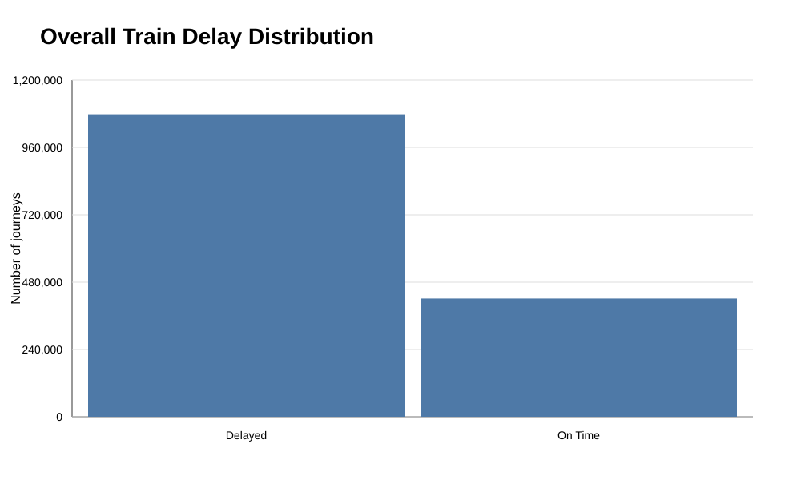
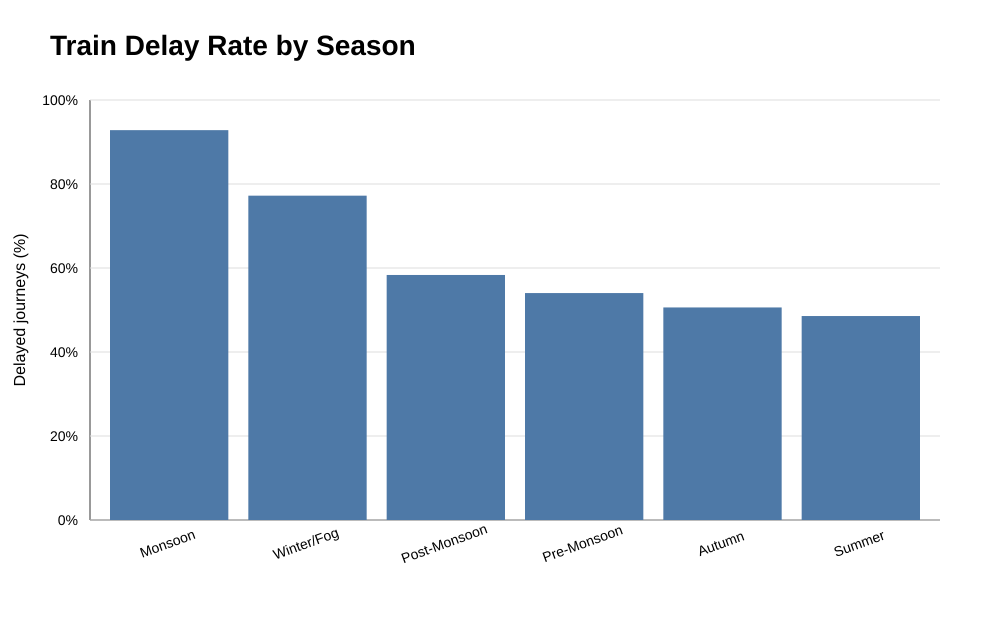
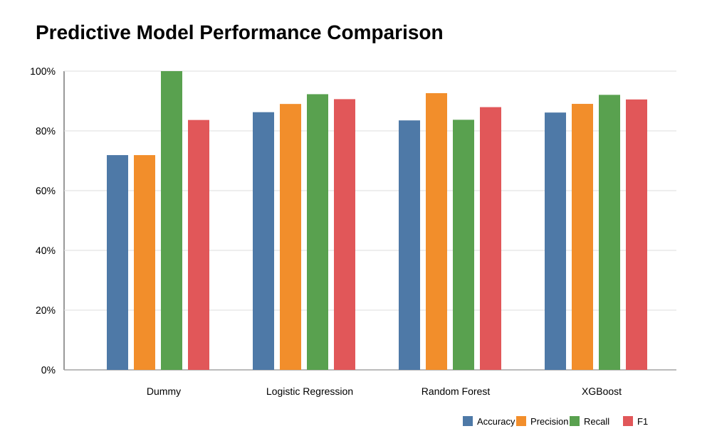
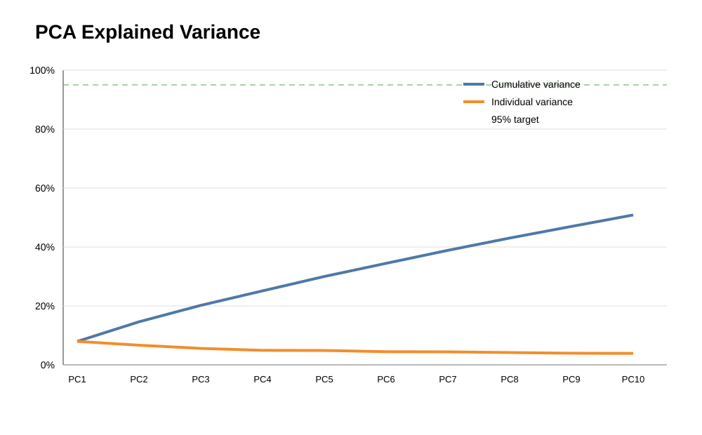

# Results and Visualizations

This directory contains project outputs and verified visualizations.

## Visualizations

### 1. Overall delay distribution

The training dataset contains **1,078,329 delayed journeys (71.89%)** and **421,671 on-time journeys (28.11%)**.

### 2. Delay rate by season

The verified seasonal delay rates range from **48.56% in Summer** to **92.82% in Monsoon**.

### 3. Predictive model performance

The comparison uses the verified validation results for Dummy Baseline, Logistic Regression, Random Forest, and XGBoost.

### 4. PCA explained variance

PCA retained **95.11% variance using 37 components** from 88 encoded dimensions.

### 5. PCA dimensionality reduction

The feature space was reduced from **88 to 37 dimensions**.

> Note: These visualizations use only verified values from the completed project. Additional EDA plots such as train-type, zone, departure-hour, and delay-cause charts should be generated from the raw CSV with the project's EDA script rather than reconstructed from qualitative summaries.
